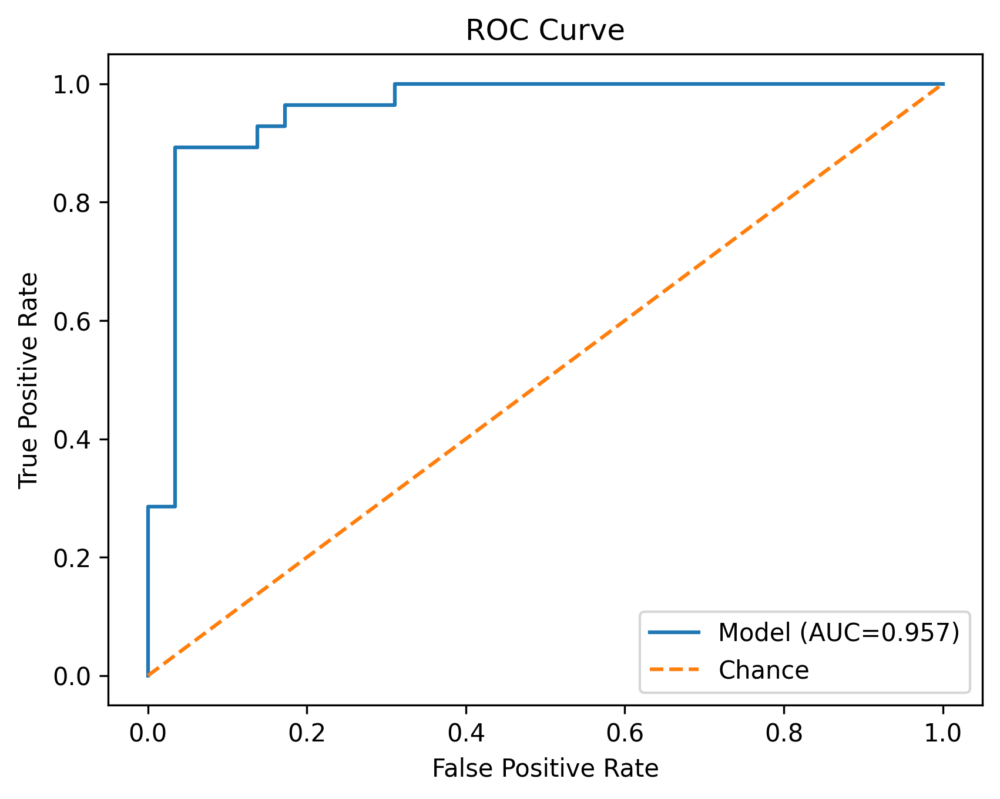
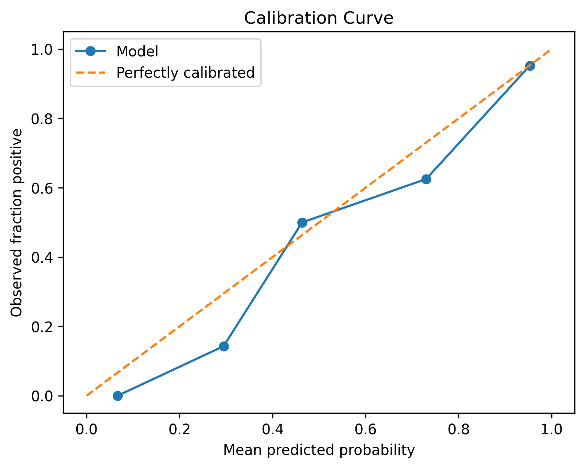
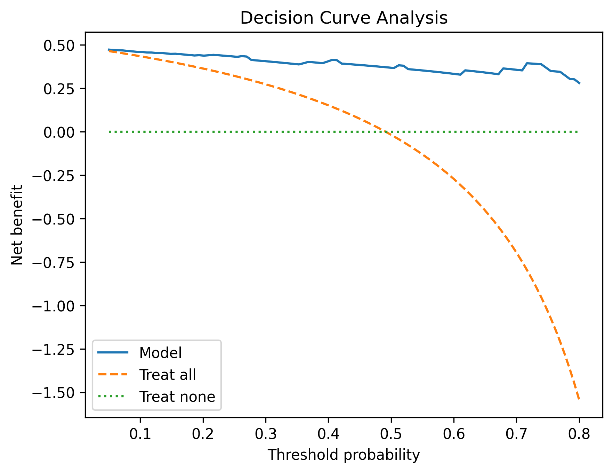
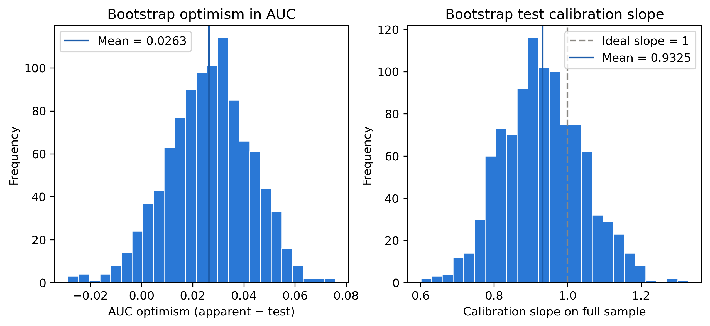
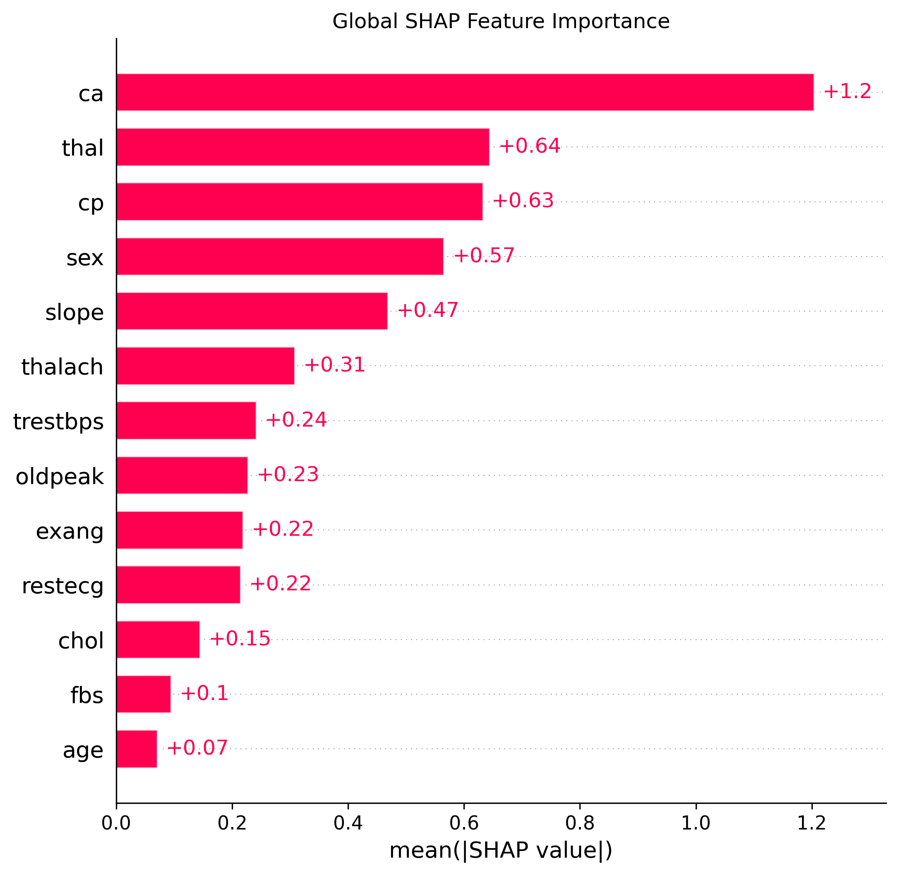
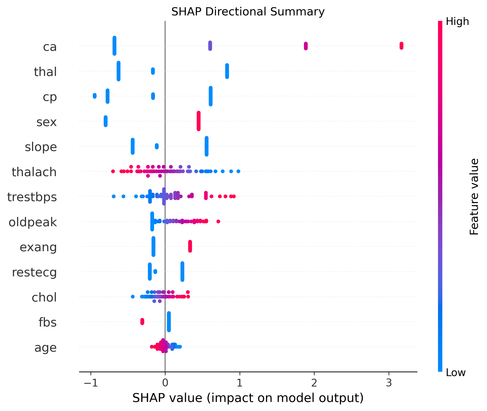
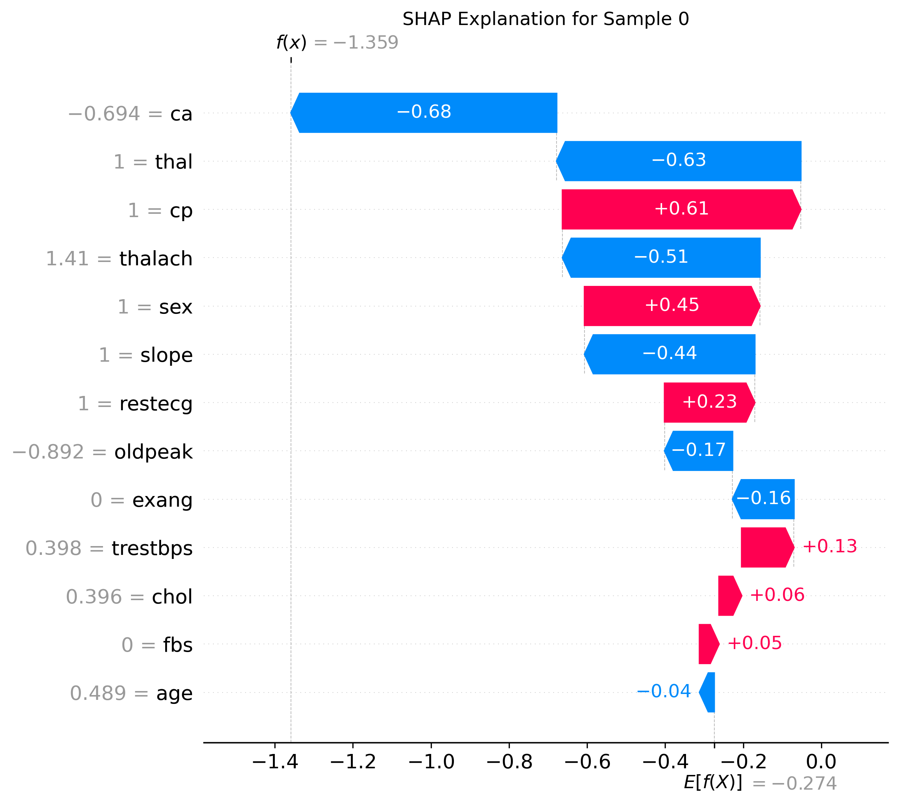

# 心脏病二分类建模（Heart Disease Analysis）

基于 [UCI Cleveland Heart Disease](https://archive.ics.uci.edu/dataset/45/heart+disease) 数据集的二分类建模项目，完整经历以下流程：

> 数据理解 → 缺失值处理 → 分层划分 → 多模型五折交叉验证 → 模型选择 → bootstrap内部验证 → 测试集最终评价（区分度、校准、决策曲线）→ SHAP 可解释性分析

## 数据集

- 数据文件：[data/raw/processed.cleveland.data](data/raw/processed.cleveland.data)，字段说明见 [data/raw/heart-disease.names](data/raw/heart-disease.names)
- 303 条样本，13 个临床特征
- 目标 `target` 由原始疾病程度 `num` 二值化得到：`target = (num > 0)`，即 0 = 无心脏病（164 例），1 = 有心脏病（139 例）
- 缺失值共 6 个（`ca` 4 个、`thal` 2 个），缺失比例低，采用完整案例删除

## 特征说明

| 特征 | 含义 | 类型 |
| --- | --- | --- |
| age | 年龄 | 连续 |
| sex | 性别（1 = 男，0 = 女） | 二分类 |
| cp | 胸痛类型（1-4） | 多分类 |
| trestbps | 静息血压 (mm Hg) | 连续 |
| chol | 血清胆固醇 (mg/dl) | 连续 |
| fbs | 空腹血糖 > 120 mg/dl（1 = 是） | 二分类 |
| restecg | 静息心电图结果（0-2） | 多分类 |
| thalach | 最大心率 | 连续 |
| exang | 运动诱发心绞痛（1 = 是） | 二分类 |
| oldpeak | 运动相对静息 ST 段压低 | 连续 |
| slope | 峰值运动 ST 段斜率（1-3） | 多分类 |
| ca | 荧光透视下主要血管数（0-3） | 计数 |
| thal | 铊显像结果（3 = 正常，6 = 固定缺损，7 = 可逆缺损） | 多分类 |

## 环境与安装

建议使用 Python 3.10+：

```powershell
python -m pip install -r requirements.txt
```

依赖：`numpy`、`pandas`、`scipy`、`scikit-learn`、`matplotlib`、`xgboost`、`shap`

## 快速开始

```powershell
python run_analysis.py
```

运行后输出：

```text
figure/   测试集 ROC、校准、DCA、Bootstrap 乐观分布图，以及 SHAP 解释图
results/  四种模型交叉验证比较结果 CSV、Bootstrap 乐观校正摘要与逐次记录 CSV
```

## 分析流程

1. **读取数据**：原始文件以 `?` 表示缺失，读取时转为 `NaN`；由 `num` 构造二分类 `target`（`num` 不进入特征，避免标签泄漏）
2. **划分数据**：按 `target` 分层 8:2 划分训练集和测试集（`random_state=42`）
3. **缺失值处理**：先检查训练集缺失情况，再决定采用完整案例删除，训练集和测试集执行相同规则（训练集 242 → 240，测试集 61 → 57），保持 X 与 y 行对齐
4. **预处理**：二分类变量保留 0/1；多分类变量 One-Hot 编码；连续变量对逻辑回归做标准化，树模型不缩放；预处理器与模型放在同一 Pipeline 中，交叉验证每一折只拟合折内训练集，避免数据泄漏
5. **模型选择**：训练集五折分层交叉验证（`StratifiedKFold`）比较四种模型，以平均 ROC-AUC 为主要指标，Brier score 为辅助指标
6. **最终拟合**：选定模型后用全部清理后的训练集重新拟合
7. **Bootstrap 乐观校正**：在训练集上对选定模型做 1000 次 bootstrap 乐观校正（Harrell 方法），估计 AUC、Brier score、校准斜率与截距的乐观性并给出校正后指标；模型选择过程的乐观性以局限形式声明
8. **测试集评价**：ROC-AUC（2000 次 bootstrap 95% CI）、Sensitivity / Specificity / PPV / NPV、混淆矩阵、Brier score、校准截距与斜率、决策曲线分析（DCA）
9. **可解释性**：用 SHAP `LinearExplainer` 解释最终模型，生成全局重要性、方向性 beeswarm 和单样本 waterfall 图

## 模型选择与结果

| 模型 | 平均 ROC-AUC | AUC 标准差 | 平均 Brier | Brier 标准差 |
| --- | --- | --- | --- | --- |
| Logistic Regression | **0.9053** | 0.0302 | **0.1196** | 0.0199 |
| Random Forest | 0.9036 | 0.0297 | 0.1304 | 0.0171 |
| L1 Logistic Regression | 0.9004 | 0.0297 | 0.1243 | 0.0179 |
| XGBoost | 0.8894 | 0.0235 | 0.1405 | 0.0153 |

交叉验证搜索到的最佳参数：L1 Logistic `C=1`；Random Forest `n_estimators=500, max_depth=5, min_samples_leaf=2`；XGBoost `n_estimators=100, max_depth=2, learning_rate=0.03`。

标准 Logistic Regression 的 AUC 最高且 Brier 最低，因此被选为最终模型。交叉验证结果仅用于模型和参数选择，不作为独立测试结论。

## Bootstrap 乐观校正内部验证

对最终模型在**训练集**（240 例）上做 1000 次 bootstrap 乐观校正（Efron 1983 / Harrell 1996）：每次重抽样重新拟合完整 Pipeline（含预处理器），分别计算 bootstrap 样本上的表观表现和原始样本上的检验表现，乐观性 = 表观 − 检验，校正值 = 全样本表观 − 平均乐观性。测试集全程保持独立。

| 指标 | Apparent | 平均 Optimism | Corrected | 95% CI* |
| --- | --- | --- | --- | --- |
| ROC-AUC | 0.9288 | 0.0263 | **0.9025** | (0.9038, 0.9253) |
| Brier score | 0.1024 | −0.0216 | **0.1241** | (0.1036, 0.1227) |
| 校准斜率 | 1.1217 | 0.2660 | **0.8558** | (0.7264, 1.1558) |
| 校准截距 | 0.0408 | 0.0830 | **−0.0422** | (−0.3777, 0.3669) |

*基于各次重抽样检验表现的百分位区间，为校正值置信区间的近似。

解读：

- **校正后 AUC 0.9025 与五折交叉验证均值 0.9053 非常接近**，两种内部验证方法结论互相印证
- 校正后校准斜率 0.8558，提示约 14% 的收缩量——18 个参数、EPV ≈ 7.7 时的过拟合代价
- 表观斜率 1.1217 大于 1，来自默认 C=1 的 L2 惩罚（系数压缩 → 预测概率欠分散）；无惩罚 MLE 的表观斜率恒为 1
- Brier 的平均乐观性估计为负（−0.0216），说明惩罚下模型在重抽样样本上的表观 Brier 并不优于全样本；校正值 0.1241 与交叉验证均值 0.1196 接近
- 校正只覆盖模型拟合过程，模型选择（四选一）的乐观性未纳入，作为局限声明

逐次重抽样记录见 `results/bootstrap_validation_records.csv`，摘要见 `results/bootstrap_validation.csv`。

## 最终测试集评价

测试集共 57 例样本（阈值 0.5）：

| 指标 | 值 | bootstrap 95% CI |
| --- | --- | --- |
| ROC-AUC | 0.9569 | (0.8916, 0.9973) |
| Sensitivity | 0.9286 | (0.8158, 1.0000) |
| Specificity | 0.8276 | (0.6857, 0.9583) |
| PPV | 0.8387 | (0.7000, 0.9615) |
| NPV | 0.9231 | (0.8000, 1.0000) |
| Brier score | 0.0850 | — |

混淆矩阵：

| | 预测 0 | 预测 1 |
| --- | --- | --- |
| 实际 0 | 24 | 5 |
| 实际 1 | 2 | 26 |

校准截距 −0.6021（理想 0）、校准斜率 1.2214（理想 1）。

> ⚠️ 测试集仅 57 例，且为单次随机划分，以上结果为**探索性结果**，不能等同于临床验证结论。

## 结果图

以下图片由 `run_analysis.py` 生成并保存到 `figure/`：

### ROC 曲线



### 校准曲线



### 决策曲线分析（DCA，阈值范围 0.05–0.80）



### Bootstrap 乐观分布

左：每次重抽样的 AUC 乐观性分布；右：检验校准斜率分布（虚线为理想斜率 1）。



### SHAP 全局特征重要性



### SHAP 方向性汇总（beeswarm）



### 单样本 SHAP 解释（测试集第 1 个样本）



## 项目结构

```text
heart+disease/
├── data/raw/              # UCI Cleveland 原始数据及字段说明
├── src/
│   ├── heart_disease/     # 核心包
│   │   ├── config.py          # 路径、列名、变量分组等公共配置
│   │   ├── data.py            # 数据读取、target 构造、分层划分
│   │   ├── preprocessing.py   # 缺失值处理、编码与标准化 Pipeline
│   │   ├── models.py          # 四种候选模型定义
│   │   ├── model_selection.py # 五折交叉验证与参数搜索
│   │   ├── bootstrap_validation.py # Bootstrap 乐观校正内部验证
│   │   ├── evaluation.py      # 测试集指标、置信区间、ROC/校准/DCA 图
│   │   └── explainability.py  # SHAP 解释与绘图
│   └── understanding.py   # 探索性数据分析
├── tests/                 # 单元测试
├── run_analysis.py        # 统一运行入口
├── figure/                # 生成的评价图与 SHAP 图
├── results/               # 模型比较结果 CSV
└── PROJECT_REPORT.txt     # 详细项目报告
```

## 探索性数据分析

`understanding.py` 可以单独运行某个分析模块：

```powershell
python src/understanding.py --analysis basic       # 数据形状、类型、描述统计
python src/understanding.py --analysis missing     # 缺失值数量、比例与模式
python src/understanding.py --analysis continuous  # 连续变量分组统计、直方图、Welch t 检验、Mann-Whitney U 检验
python src/understanding.py --analysis categorical # 分类变量频数与比例
python src/understanding.py --analysis chi2        # 分类变量与 target 的卡方检验
python src/understanding.py --analysis all         # 全部模块
```

## 单元测试

```powershell
python -m unittest discover -s tests -v
```

## 局限与改进方向

- 测试集样本量小（57 例），最终指标波动较大，应作为探索性验证
- 仅做单次随机划分，未做重复交叉验证或外部验证
- Bootstrap 乐观校正只针对选定模型（Logistic Regression）的拟合过程，模型选择（四选一）本身的乐观性未纳入，已在报告中声明
- 缺失值采用完整案例删除，适用前提是缺失比例低；缺失比例较高时应考虑插补
- SHAP 解释反映的是模型关联而非医学因果关系
- 可进一步增加：全策略嵌套 bootstrap（含模型选择）、概率校准方法比较、重复交叉验证、更大独立验证集

## 参考

- [UCI Machine Learning Repository: Heart Disease](https://archive.ics.uci.edu/dataset/45/heart+disease)
- Lundberg, S. M., & Lee, S.-I. (2017). [A Unified Approach to Interpreting Model Predictions](https://arxiv.org/abs/1705.07874)
